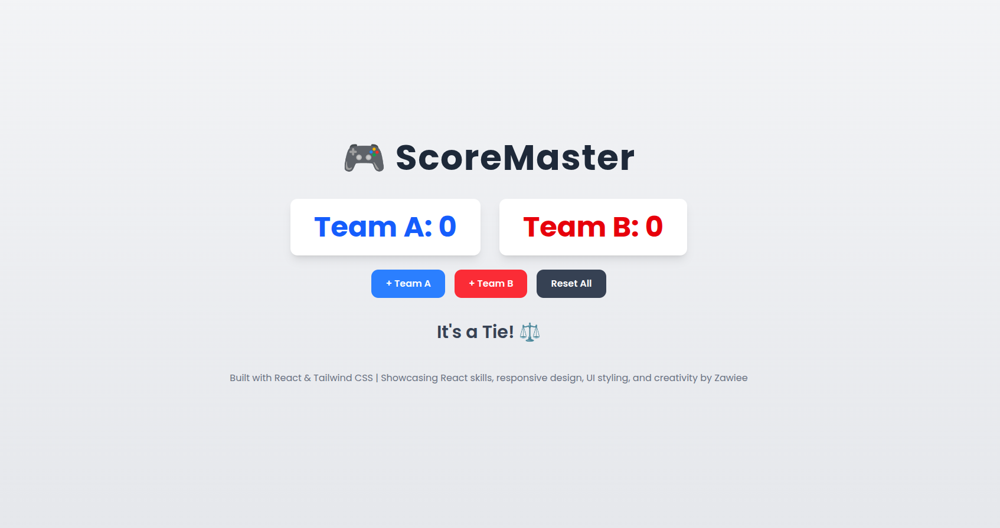

# ScoreMaster

**ScoreMaster** is a fun, modern mini React app to track scores for two teams. Built with **React** and **Tailwind CSS**, it demonstrates:

- React state management
- Responsive design
- UI styling and component-based architecture
- Interactive buttons with hover and scale effects

---

## Features

- Increment scores for **Team A** and **Team B**
- Reset all scores with a single click
- Dynamic winner display:
  - "Team A Wins! 🏆"
  - "Team B Wins! 🏆"
  - "It's a Tie! ⚖️"
- Responsive layout for mobile and desktop
- Modern, clean design with **Poppins** font
- Polished buttons with hover and subtle scaling effect

---

## Screenshots 




## Tech Stack

- **React** : Frontend framework  
- **Tailwind CSS** : Utility-first CSS for styling  
- **Vite** : Dev server and build tool  

---

## How to Run Locally

1. Clone the repository:

```bash
git clone https://github.com/YourUsername/React-projects-for-beginners.git
cd React-projects-for-beginners/score-tracker-app
```
2. Install dependencies:
```bash
npm install
``` 

3. Start the development server:
```bash
npm run dev
```
4. Open the browser at the URL displayed (usually http://localhost:5173)

---

##  Folder Structure
```
score-tracker-app/
├─ src/
│  ├─ components/
│  │  ├─ ScoreBoard.jsx
│  │  └─ Controls.jsx
│  ├─ App.jsx
│  ├─ main.jsx
│  └─ index.css
├─ package.json
└─ vite.config.js
```
---

## Author
Grace Zawadi
Nairobi, Kenya
